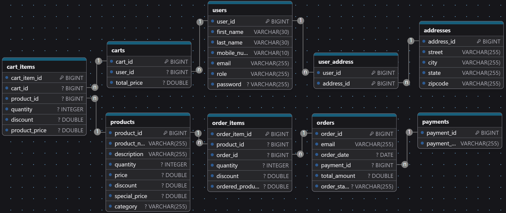
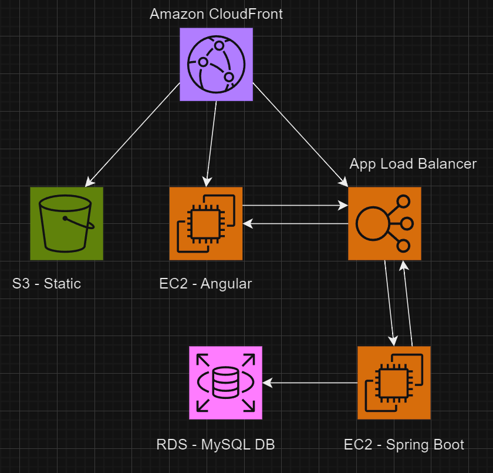

# Capstone Assignment: Next Big Idea Development
Company X is a conglomerate, which means they are made up of many different businesses. They have dipped their toes in creating all types of products and services, but are looking to invest in their next big idea.

You are tasked to come up with this new application that can be marketed by Company X. They don’t mind any idea you come up with, but the application should be able to maintain a set of users in some way.

The final application should showcase all the main functionalities you expect of
your idea.

While deciding on what type of product you will build, make sure you can answer the
following questions:

1. What does the application do?
2. Who is the target audience for this application?
3. How is it useful?

## Requirements

The Full-Stack Application you build must have:
1. Frontend created using Angular
    - Utilize the Angular's built-in Router
    - Should consume the APIs you built
2. Maintain a set of users that can login to whatever application you build
3. Backend Service using Java Spring Boot
    - Must use JPA with a MySQL database
    - Include at least one Validation annotation
    - At least one custom query (using naming rules or @Query)
    - Have at least one custom exception and contain a Global Exception Handler
    - Set up testing with Mockito & JUnit for your APIs
    - Utilize Postman to test the API's along the way (TDD)
    - Add in Swagger documentation
    - Set up security using JWTs
4. Deploy your project fully on AWS

___

## ER Diagram:

## Wire Diagram:

```mermaid
C4Context
    title Angular Front-End Application Architecture

    Person(user, "User", "A customer who interacts with the application.")
    
    System_Boundary(container_boundary, "Angular Application") {
        Container(signin_component, "SignInComponent", "Angular Component", "Handles user login.")
        Container(home_component, "HomeComponent", "Angular Component", "Displays available product categories.")
        Container(product_component, "ProductComponent", "Angular Component", "Dynamically filters and displays products by category.")
        Container(product_detail_component, "ProductDetailComponent", "Angular Component", "Shows details of the selected product.")
        Container(profile_component, "ProfileComponent", "Angular Component", "Displays and manages user profile information.")
        Container(cart_component, "CartComponent", "Angular Component", "Shows items in the shopping cart.")
        Container(checkout_component, "CheckoutComponent", "Angular Component", "Handles the order review and checkout process.")
        
        Component(auth_service, "AuthService", "Angular Service", "Manages user authentication and token storage.")
        Component(product_service, "ProductService", "Angular Service", "Fetches product data and manages filtering.")
        Component(profile_service, "ProfileService", "Angular Service", "Handles user profile-related operations.")
        Component(cart_service, "CartService", "Angular Service", "Manages cart contents and operations.")
        Component(order_service, "OrderService", "Angular Service", "Handles order-related processes.")
    }

    Rel(user, signin_component, "Logs in through") 
    Rel(user, home_component, "Browses categories on")
    Rel(user, product_component, "Filters products on")
    Rel(product_component, product_detail_component, "Views details on selected product")
    Rel(user, profile_component, "Manages profile on")
    Rel(user, cart_component, "Views and updates cart on")
    Rel(user, checkout_component, "Completes purchase through")

    Rel(signin_component, auth_service, "Uses for authentication")
    Rel(home_component, product_service, "Retrieves categories and details")
    Rel(product_component, product_service, "Fetches and filters product data")
    Rel(profile_component, profile_service, "Loads and updates profile info")
    Rel(cart_component, cart_service, "Interacts for cart operations")
    Rel(checkout_component, order_service, "Processes orders")

    UpdateRelStyle(user, signin_component, $textColor="yellow", $lineColor="yellow")
    UpdateRelStyle(user, home_component, $textColor="yellow", $lineColor="yellow")
    UpdateRelStyle(user, product_component, $textColor="yellow", $lineColor="yellow")
    UpdateRelStyle(product_component, product_detail_component, $textColor="yellow", $lineColor="yellow")
    UpdateRelStyle(user, profile_component, $textColor="yellow", $lineColor="yellow")
    UpdateRelStyle(user, cart_component, $textColor="yellow", $lineColor="yellow")
    UpdateRelStyle(user, checkout_component, $textColor="yellow", $lineColor="yellow")

    UpdateRelStyle(signin_component, auth_service, $textColor="yellow", $lineColor="yellow")
    UpdateRelStyle(home_component, product_service, $textColor="yellow", $lineColor="yellow")
    UpdateRelStyle(product_component, product_service, $textColor="yellow", $lineColor="yellow")
    UpdateRelStyle(profile_component, profile_service, $textColor="yellow", $lineColor="yellow")
    UpdateRelStyle(cart_component, cart_service, $textColor="yellow", $lineColor="yellow")
    UpdateRelStyle(checkout_component, order_service, $textColor="yellow", $lineColor="yellow")
```

## Proposed AWS Architecture:

## Backlog

### Backend Testing with Postman

#### 1. **Create a Postman Collection**
   - Set up Postman collection to organize API requests.

#### 2. **Define API Request Tests**
   - **Authentication API Tests**
     - Create requests to test login and logout endpoints.
     - Validate correct user credentials and error responses for invalid inputs.
   - **CRUD Operations**
     - Set up requests to validate CRUD operations for core entities.
     - Check for correct HTTP status codes (200, 201, 400, etc.) and response body content.

#### 3. **Implement Automated Testing**
   - Use Postman's built-in test scripts to automate response validation.

#### 4. **Set Up Environment Variables**
   - Define variables for dynamic data such as authorization tokens
   - Use Postman Pre-request scripts to dynamically set values required for requests.

#### 5. **Chain Requests for End-to-End Testing**
   - Create request chains to simulate user interactions.

#### 6. **Debug and Refine Tests**
   - Run test collection in Postman and debug any failing tests.

### Front-End Development with Angular

#### 1. **Set Up the Angular Project**
   - Initialize a new Angular project using Angular CLI.
   - Configure project structure and install necessary dependencies.

#### 2. **Develop Core Components**
   - **SignInComponent**
     - Create and style the user login form.
     - Implement authentication logic using `AuthService`.
   - **HomeComponent**
     - Display product categories.
     - Set up routing from categories to ProductComponent.
   - **ProductComponent**
     - Implement filtering logic.
     - Display products based on category selection.
   - **ProductDetailComponent**
     - Create detailed product view template.
     - Implement data fetching from `ProductService`.
   - **ProfileComponent**
     - Design profile interface for viewing and editing user info.
     - Integrate form validation and update functions.
   - **CartComponent**
     - Display cart items with options to modify quantities.
     - Implement interaction with `CartService` for cart operations.
   - **CheckoutComponent**
     - Develop order review and payment input interface.
     - Integrate order processing flow with `OrderService`.

#### 3. **Develop Services and State Management**
   - **AuthService**
     - Establish authentication methods for login and logout.
     - Handle JWT storage and retrieval from local storage.
   - **ProductService**
     - Set up HTTP client for fetching products and categories.
     - Implement product filtering and sorting logic.
   - **ProfileService**
     - Create methods for fetching and updating user profiles.
   - **CartService**
     - Handle adding, removing, and updating cart items.
   - **OrderService**
     - Manage order submission, confirmation, and history retrieval.

#### 4. **Implement Routing and Navigation**
   - Configure routing for each component.
   - Implement guards for securing routes based on authentication status.

#### 5. **UI/UX Enhancements**
   - Apply styling and theming (CSS/SASS).
   - Ensure responsive design for mobile and desktop views.
   - Conduct usability testing and make necessary adjustments.

#### 6. **Testing and Debugging**
   - Write unit tests for components and services using Jasmine and Karma.
   - Perform end-to-end testing using Protractor or Cypress.
   - Debug and resolve any issues identified during testing phases.

#### 7. **Deployment Preparation**
   - Optimize the build for production.
   - Configure environment files for different deployment stages.

### AWS Deployment Task List Based on Probable Architecture

#### 1. **Deploy Frontend on Amazon S3 and CloudFront**
   - **Amazon S3**
     - Create an S3 bucket to host static assets (HTML, CSS, JS).
     - Configure bucket policies for public access to allow CloudFront to retrieve the contents.

   - **Amazon CloudFront**
     - Set up CloudFront distribution pointing to your S3 bucket as the origin.
     - Configure caching and SSL/TLS settings for security and performance.

#### 2. **Deploy Frontend Logic on EC2**
   - Launch an EC2 instance for running the Angular application logic.
   - Configure security groups for access through CloudFront.
   - Deploy the Angular application using a suitable web server (e.g., NGINX).

#### 3. **Load Balancing with Application Load Balancer (ALB)**
   - Establish an ALB to handle user HTTP/S requests.
   - Target the backend EC2 instances for incoming traffic.
   - Configure health checks and rules for routing traffic efficiently.

#### 4. **Backend Deployment and Database Configuration**
   - **Amazon EC2 for Spring Boot Application**
     - Launch EC2 instances to host your Spring Boot backend.
     - Configure the environment by installing necessary software (JRE, web server).
     - Deploy the Spring Boot application.

   - **Amazon RDS**
     - Set up an RDS instance for managing your database.
     - Configure security groups to allow connections from backend EC2 instances.

#### 5. **Content Distribution and Frontend Integration**
   - Ensure CloudFront is distributing CDN content.
   - Configure interactions between the Angular application on EC2 and backend EC2 using the ALB.

#### 6. **Monitoring and Logging with CloudWatch**
   - Enable CloudWatch monitoring for both backend and frontend EC2 instances.
   - Set up CloudWatch alarms for critical performance metrics.
   - Configure log streams for application logs on EC2.
