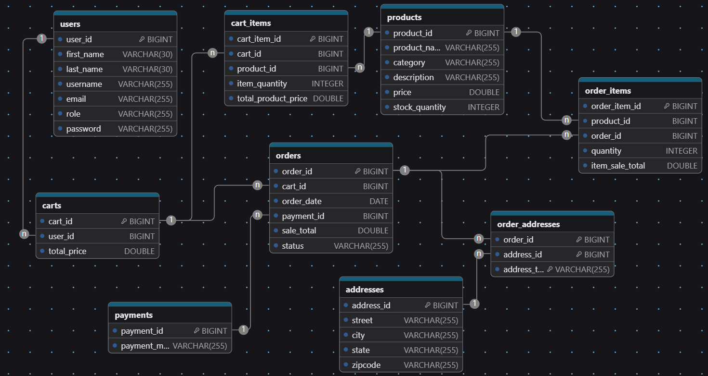

# Capstone Assignment: Next Big Idea Development
Company X is a conglomerate, which means they are made up of many different businesses. They have dipped their toes in creating all types of products and services, but are looking to invest in their next big idea.

You are tasked to come up with this new application that can be marketed by Company X. They don’t mind any idea you come up with, but the application should be able to maintain a set of users in some way.

The final application should showcase all the main functionalities you expect of
your idea.

While deciding on what type of product you will build, make sure you can answer the
following questions:

1. What does the application do?
2. Who is the target audience for this application?
3. How is it useful?

## Requirements

The Full-Stack Application you build must have:
1. Frontend created using Angular
    - Utilize the Angular's built-in Router
    - Should consume the APIs you built
2. Maintain a set of users that can login to whatever application you build
3. Backend Service using Java Spring Boot
    - Must use JPA with a MySQL database
    - Include at least one Validation annotation
    - At least one custom query (using naming rules or @Query)
    - Have at least one custom exception and contain a Global Exception Handler
    - Set up testing with Mockito & JUnit for your APIs
    - Utilize Postman to test the API's along the way (TDD)
    - Add in Swagger documentation
    - Set up security using JWTs
4. Deploy your project fully on AWS

___

## ER Diagram:

## Wire Diagram:

```mermaid
C4Context
    title Angular Front-End Application Architecture

    Person(user, "User", "A customer who interacts with the application.")
    
    System_Boundary(container_boundary, "Angular Application") {
        Container(signin_component, "SignInComponent", "Angular Component", "Handles user login.")
        Container(home_component, "HomeComponent", "Angular Component", "Displays available product categories.")
        Container(product_component, "ProductComponent", "Angular Component", "Dynamically filters and displays products by category.")
        Container(product_detail_component, "ProductDetailComponent", "Angular Component", "Shows details of the selected product.")
        Container(profile_component, "ProfileComponent", "Angular Component", "Displays and manages user profile information.")
        Container(cart_component, "CartComponent", "Angular Component", "Shows items in the shopping cart.")
        Container(checkout_component, "CheckoutComponent", "Angular Component", "Handles the order review and checkout process.")
        
        Component(auth_service, "AuthService", "Angular Service", "Manages user authentication and token storage.")
        Component(product_service, "ProductService", "Angular Service", "Fetches product data and manages filtering.")
        Component(profile_service, "ProfileService", "Angular Service", "Handles user profile-related operations.")
        Component(cart_service, "CartService", "Angular Service", "Manages cart contents and operations.")
        Component(order_service, "OrderService", "Angular Service", "Handles order-related processes.")
    }

    Rel(user, signin_component, "Logs in through") 
    Rel(user, home_component, "Browses categories on")
    Rel(user, product_component, "Filters products on")
    Rel(product_component, product_detail_component, "Views details on selected product")
    Rel(user, profile_component, "Manages profile on")
    Rel(user, cart_component, "Views and updates cart on")
    Rel(user, checkout_component, "Completes purchase through")

    Rel(signin_component, auth_service, "Uses for authentication")
    Rel(home_component, product_service, "Retrieves categories and details")
    Rel(product_component, product_service, "Fetches and filters product data")
    Rel(profile_component, profile_service, "Loads and updates profile info")
    Rel(cart_component, cart_service, "Interacts for cart operations")
    Rel(checkout_component, order_service, "Processes orders")

    UpdateRelStyle(user, signin_component, $textColor="yellow", $lineColor="yellow")
    UpdateRelStyle(user, home_component, $textColor="yellow", $lineColor="yellow")
    UpdateRelStyle(user, product_component, $textColor="yellow", $lineColor="yellow")
    UpdateRelStyle(product_component, product_detail_component, $textColor="yellow", $lineColor="yellow")
    UpdateRelStyle(user, profile_component, $textColor="yellow", $lineColor="yellow")
    UpdateRelStyle(user, cart_component, $textColor="yellow", $lineColor="yellow")
    UpdateRelStyle(user, checkout_component, $textColor="yellow", $lineColor="yellow")

    UpdateRelStyle(signin_component, auth_service, $textColor="yellow", $lineColor="yellow")
    UpdateRelStyle(home_component, product_service, $textColor="yellow", $lineColor="yellow")
    UpdateRelStyle(product_component, product_service, $textColor="yellow", $lineColor="yellow")
    UpdateRelStyle(profile_component, profile_service, $textColor="yellow", $lineColor="yellow")
    UpdateRelStyle(cart_component, cart_service, $textColor="yellow", $lineColor="yellow")
    UpdateRelStyle(checkout_component, order_service, $textColor="yellow", $lineColor="yellow")
```

